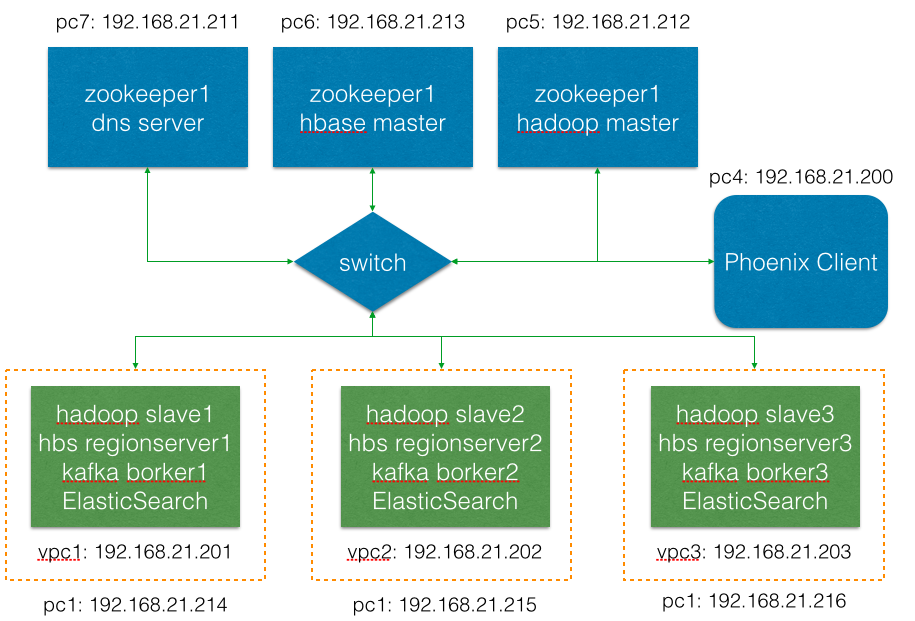

CentOS6.5 x64 部署大数据集群运行环境
===

# 一、硬件环境

### 1. 集群硬件
|No.|CPU|RAM|HDD|
|:---:|:---|:---:|:---|
|PC1|i7 4770 3.4G 4core8thread |24G DDR3 1600MHz|2TB 7200rpm|
|PC2|i7 4770 3.4G 4core8thread |24G DDR3 1600MHz|2TB 7200rpm|
|PC3|i7 4770 3.4G 4core8thread |24G DDR3 1600MHz|2TB 7200rpm|
|PC4|i5 760 2.8G 2core4thread|4G DDR2 800MHz|1TB 7200rpm|
|PC5|Intel Dual-Core E7400@2.8GHz|4G DDR2 800MHz|320GB 7200rpm|
|PC6|Pentium Dual-Core E5200@2.5GHz|4G DDR2 800MHz|320GB 7200rpm|
|PC7|Pentium Dual-Core E5200@2.5GHz|2G DDR2 800MHz|250GB 7200rpm|

### 2. 资源分配和拓扑

