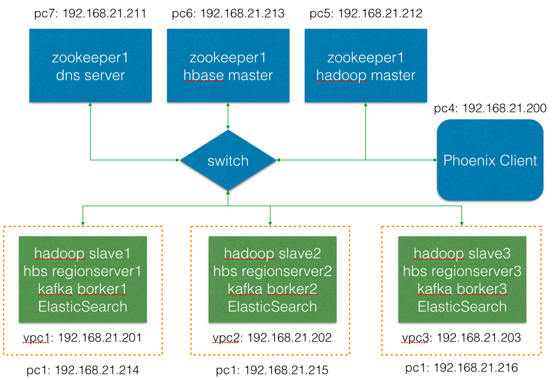

CentOS7 x64 部署大数据集群运行环境
===

# 一、硬件环境

### 1. 集群硬件

|No.|CPU|RAM|HDD|
|:---:|:---|:---:|:---|
|PC1|i7 4770 3.4G 4core8thread |24G DDR3 1600MHz|2TB 7200rpm|
|PC2|i7 4770 3.4G 4core8thread |24G DDR3 1600MHz|2TB 7200rpm|
|PC3|i7 4770 3.4G 4core8thread |24G DDR3 1600MHz|2TB 7200rpm|
|PC4|i5 760 2.8G 2core4thread|4G DDR2 800MHz|1TB 7200rpm|
|PC5|Intel Dual-Core E7400@2.8GHz|4G DDR2 800MHz|320GB 7200rpm|
|PC6|Pentium Dual-Core E5200@2.5GHz|4G DDR2 800MHz|320GB 7200rpm|
|PC7|Pentium Dual-Core E5200@2.5GHz|2G DDR2 800MHz|250GB 7200rpm|
### 2.系统构架图
==暂缺==

### 3. 资源分配和拓扑
系统硬件包括7台PC。如下图所示，其中PC1～PC3作为集群三个**slave**，PC4 则为**Client**同时也是内部时钟同步服务器；PC5～PC6为zookeeper和master. slave是已虚拟机方式部署在三台已经部署了EXSi的PC机中。以slave1为例：slave1 所在PC4 IP地址为192.168.21.213. 但slave1系统实际地址为 192.168.21.201. 最新 Intel i7 ＋ z97 的EXSi安装参考附录1.

