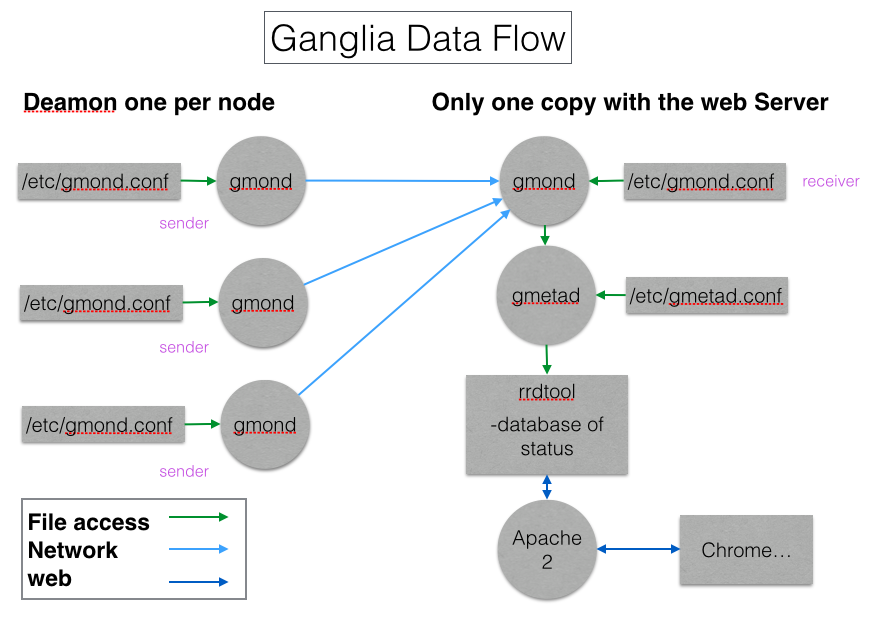

Ganglia 安装
----
Ganglia 是 UC Berkeley 发起的一个开源监视项目，设计用于测量数以千计的节点。每台计算机都运行一个收集和发送度量数据（如处理器速度、内存使用量等）的名为 gmond 的守护进程。它将从操作系统和指定主机中收集。接收所有度量数据的主机可以显示这些数据并且可以将这些数据的精简表单传递到层次结构中。正因为有这种层次结构模式，才使得 Ganglia 可以实现良好的扩展。gmond 带来的系统负载非常少，这使得它成为在集群中各台计算机上运行的一段代码，而不会影响用户性能。

### 1. Ganglia组件
Ganglia 监控套件包括三个主要部分：**gmond**，**gmetad**，和网页接口**ganglia-web**。
- **gmond**: 是一个守护进程，他运行在每一个需要监测的节点上，收集监测统计，发送和接受在同一个组播或单播通道上的统计信息 如果他是一个发送者(mute=no)他会收集基本指标，比如系统负载（load_one）,CPU利用率。他同时也会发送用户通过添加C/Python模块来自定义的指标。 如果他是一个接收者（deaf=no）他会聚合所有从别的主机上发来的指标，并把它们都保存在内存缓冲区中。
- **gmetad**: 也是一个守护进程，他定期检查gmonds，从那里拉取数据，并将他们的指标存储在RRD存储引擎中。他可以查询多个集群并聚合指标。他也被用于生成用户界面的web前端。
- **ganglia-web**:顾名思义，他应该安装在有gmetad运行的机器上，以便读取RRD文件。 集群是主机和度量数据的逻辑分组，比如数据库服务器，网页服务器，生产，测试，QA等，他们都是完全分开的，你需要为每个集群运行单独的gmond实例。

一般来说每个集群需要一个接收的gmond，每个网站需要一个gmetad

**Ganglia工作流如图所示:**


左边是运行在各个节点上的gmond进程，这个进程的配置只由节点上/etc/gmond.conf的文件决定。所以，在各个监视节点上都需要安装和配置该文件。右上角是更加负责的中心机（通常是这个集群中的一台，也可以不是）。在这个台机器上运行这着gmetad进程，收集来自各个节点上的信息并存储在rrdtool上，该进程的配置只由etc/gmetad.conf决定。右下角显示了关于网页方面的一些信息。我们的浏览网站时调用php脚本，从RRDTool数据库中抓取信息，动态的生成各类图表。
### 2. 安装必要依赖
切换至**root**用户:

```bash
[root@monitor ~]# yum install –y gcc gcc-c++ libpng freetype zlib libdbi apr* libxml2-devel pkg-config glib pixman pango pango-devel freetye-devel fontconfig cairo cairo-devel libart_lgpl libart_lgpl-devel pcre* rrdtool*
```
### 3. 安装expat依赖
```bash
[root@monitor ~]# cd /home/dream
[root@monitor ~]# wget http://jaist.dl.sourceforge.net/project/expat/expat/2.1.0/expat-2.1.0.tar.gz
[root@monitor ~]# tar -xf expat-2.1.0.tar.gz
[root@monitor ~]# cd expat-2.1.0
[root@monitor ~]# ./configure --prefix=/usr/local/expat
[root@monitor ~]# make -j4 && make install
```
对于64位操作系统，需要手动拷贝动态链接库到lib64下:

```bash
[root@monitor ~]# mkdir /usr/local/expat/lib64  
[root@monitor ~]# cp -a /usr/local/expat/lib/* /usr/local/expat/lib64/

```
### 4. 安装confuse依赖
```bash
[root@monitor ~]# cd /home/dream
[root@monitor ~]# wget http://ftp.twaren.net/Unix/NonGNU//confuse/confuse-2.7.tar.gz
[root@monitor ~]# tar -xf confuse-2.7.tar.gz
[root@monitor ~]# cd confuse-2.7
[root@monitor ~]# ./configure CFLAGS=-fPIC --disable-nls --prefix=/usr/local/confuse
[root@monitor ~]# make -j4 && make install
```
对于64位操作系统，需要手动拷贝动态链接库到lib64下：

```bash
[root@monitor ~]# mkdir -p /usr/local/confuse/lib64  
[root@monitor ~]# cp -a -f /usr/local/confuse/lib/* /usr/local/confuse/lib64/
```
### 5. 安装Ganlia

```bash
[root@monitor ~]# cd /home/dream
[root@monitor ~]# wget http://jaist.dl.sourceforge.net/project/ganglia/ganglia%20monitoring%20core/3.6.0/ganglia-3.6.0.tar.gz
[root@monitor ~]# tar -xf ganglia-3.6.0.tar.gz
[root@monitor ~]# cd confuse-2.7
[root@monitor ~]# ./configure --with-gmetad --enable-gexec --with-libconfuse=/usr/local/confuse --with-libexpat=/usr/local/expat --prefix=/usr/local/ganglia --sysconfdir=/etc/ganglia
[root@monitor ~]# make -j4 && make install
```
添加至系统服务，对于服务端:

```bash
[root@monitor ~]# cp -f gmetad/gmetad.init /etc/init.d/gmetad
[root@monitor ~]# cp -f /usr/local/ganglia/sbin/gmetad /usr/sbin/gmetad
[root@monitor ~]# chkconfig --add gmetad
```
客户端：

```bash
[root@slave1 ~]# cp -f gmond/gmond.init /etc/init.d/gmond  
[root@slave1 ~]# cp -f /usr/local/ganglia/sbin/gmond /usr/sbin/gmond  
[root@slave1 ~]# chkconfig --add gmond  
[root@slave1 ~]# gmond --default_config > /etc/ganglia/gmond.conf
```
### 6. 服务端配置(gmetad节点)
创建**rrdtool**数据目录，并根据apache的运行用户创建权限，例如apache运行于apache用户上 。

```bash
[root@monitor ~]# mkdir -p /var/lib/ganglia/rrds
[root@monitor ~]# mkdir -p /var/lib/ganglia/dwoo
[root@monitor ~]# chown -R root:root /var/lib/ganglia
```
配置gmetad服务，修改文件 **/etc/ganglia/gmetad.conf**:

```apaheconf
data_source "dream" 192.168.21.210 #gmetad 运行服务端地址
gridname "master"
```
启动gmetad服务。看到`start GANGLIA gmetad:[OK]`就代表运行正常了。通过`telnet localhost 8651`验证是否已经正常启动了。

```bash
[root@monitor ~]# service gmetad start
```

数据接收端口配置 **/etc/ganglia/gmond.conf**：
 
```apacheconf
 globals {  
   daemonize = yes  
   setuid = yes  
   user = root /*运行Ganglia的用户*/  
   debug_level = 0  
   max_udp_msg_len = 1472  
   mute = no  
   deaf = no  
   host_dmax = 120 /*secs */  
   cleanup_threshold = 300 /*secs */  
   gexec = no  
   send_metadata_interval = 30 /*发送数据的时间间隔*/  
 }  

 cluster {  
   name = "dream" /*集群名称*/  
   owner = "root" /*运行Ganglia的用户*/  
   latlong = "unspecified"  
   url = "unspecified"  
 }  

 udp_send_channel {  
   #  mcast_join =  239.2.11.71  /*注释掉组播*/  
   #  host = 192.168.1.108  
   port = 8649  
   ttl = 1  
 }  

 udp_recv_channel {  #接受UDP包配置  
   # mcast_join = 239.2.11.71  
   port = 8649 /*端口*/
   bind = 192.168.21.210 /*绑定gmetad接受端地址*/
 }
```
启动gmond服务(监听client端发过来数据)。看到`start GANGLIA gomnd:[OK]`就代表运行正常了。通过`telnet localhost 8649`验证是否已经正常启动了。

```bash
[root@monitor ~]# service gmond start
```

### 7. 客户端配置(gmond节点)

客户端配置文件**/etc/ganglia/gmond.conf**:

```apacheconf
globals {  
   daemonize = yes  
   setuid = yes  
   user = root /*运行Ganglia的用户*/  
   debug_level = 0  
   max_udp_msg_len = 1472  
   mute = no  
   deaf = no  
   host_dmax = 120 /*secs */  
   cleanup_threshold = 300 /*secs */  
   gexec = no  
   send_metadata_interval = 30 /*发送数据的时间间隔*/  
 }  

 cluster {  
   name = "dream" /*集群名称*/  
   owner = "root" /*运行Ganglia的用户*/  
   latlong = "unspecified"  
   url = "unspecified"  
 }  

 udp_send_channel {  
   #  mcast_join =  239.2.11.71  /*注释掉组播*/  
   host = 192.168.21.210 /*发送给安装gmetad的机器*/  
   port = 8649  
   ttl = 1  
 }  

 udp_recv_channel {  #接受UDP包配置  
   # mcast_join = 239.2.11.71  
   port = 8649 /*端口*/
   # bind = 192.168.21.210 
 }
```
启动gmond服务（向数据采集端发送数据),查看方式如数据接受端：

```bash
[root@monitor ~]# service gmetad start
```
### 8. Web服务配置
##### Apache httpd服务安装配置
```bash
[root@monitor ~]# yum -y install php httpd
[root@monitor ~]# service httpd start //启动httpd 服务
```
测试安装是否安装成功。新建并保存文件 **/var/www/html/index.php**。使用浏览器查看 192.168.21.210/index.php，正常看到的是PHP的信息。

```php
<?php
phpinfo();
?>
```
安装Ganglia-web数据包。

```bash
[root@monitor ~]# cd /home/ruifeng.shan  
[root@monitor ~]# wget http://jaist.dl.sourceforge.net/project/ganglia/ganglia-web/3.5.10/ganglia-web-3.5.10.tar.gz  
[root@monitor ~]# tar -xf ganglia-web-3.5.10.tar.gz  
[root@monitor ~]# cd ganglia-web-3.5.10  
[root@monitor ~]# make install
```
这样在目录**/var/www/html**中生成了目录**ganglia**。通过http://192.168.21.210/ganglia集群状态信息

### 9. Ganglia监控HADOOP、HBASE配置选项
对于Hadoop需要配置`HADOOP_CONF_DIR`目录下文件**hadoop-metrics2.properties**:

```apacheconf
##############一定要注释掉原来的这块，否则会监控不到#########  
#*.sink.file.class=org.apache.hadoop.metrics2.sink.FileSink  
# default sampling period, in seconds  
#*.period=10  
#############################################################

namenode.sink.ganglia.servers=192.168.21.210:8649
resourcemanager.sink.ganglia.servers= 192.168.21.210:8649
datanode.sink.ganglia.servers= 192.168.21.210:8649
nodemanager.sink.ganglia.servers= 192.168.21.210:8649 
maptask.sink.ganglia.servers= 192.168.21.210:8649
reducetask.sink.ganglia.servers= 192.168.21.210:8649  
```
对于HBase需要配置`HBASE_CONF_DIR`目录下文件**hadoop-metrics2-hbase.properties**:

```apacheconf
##############一定要注释掉原来的这块，否则会监控不到#########  
#*.sink.file.class=org.apache.hadoop.metrics2.sink.FileSink  
# default sampling period, in seconds  
#*.period=10  
#############################################################

*.sink.ganglia.class=org.apache.hadoop.metrics2.sink.ganglia.GangliaSink31
*.sink.ganglia.period=10
hbase.sink.ganglia.period=10
hbase.sink.ganglia.servers=192.168.21.210:8649 
```

### 10.0 错误处理
###### Ganglia访问失败：
> There was an error collecting ganglia data (127.0.0.1:8652): fsockopen error: Permission denied

###### 解决方法：
关闭selinux：在文件**/etc/selinux/config**，把`SELINUX=enforcing`改成`SELINUX=disable`；然后重启机器。可以使用命令`setenforce 0`临时来关闭selinux而不需要重启，刷新页面，即可访问。 重启httpd服务器即可看到效果。
