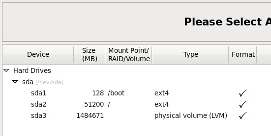

#附录3 Linux LVM 逻辑卷配置安装

### 1.系统安装部分
在虚拟机里安装Linux系统（CentOS6.5 x86_64 minimal）并预留分区给LVM卷：

### 2.创建卷组
安装完成后，使用`fdisk －l`查看当前系统分区情况：

```bash
[root@slave3 ~]# fdisk -l

Disk /dev/sda: 1610.6 GB, 1610612736000 bytes
255 heads, 63 sectors/track, 195812 cylinders
Units = cylinders of 16065 * 512 = 8225280 bytes
Sector size (logical/physical): 512 bytes / 512 bytes
I/O size (minimum/optimal): 512 bytes / 512 bytes
Disk identifier: 0x00020156

   Device Boot      Start         End      Blocks   Id  System
/dev/sda1   *           1          17      131072   83  Linux
Partition 1 does not end on cylinder boundary.
/dev/sda2              17        6544    52428800   83  Linux
/dev/sda3            6544      195813  1520303104   8e  Linux LVM
[root@slave3 ~]#
```
可以看到`/dev/sda3`已经是分区ID为**8e**（如果要新建LVM格式分区，参考后续扩容操作）。使用 `pvdisplay`查看当前物理卷：

```bash
[root@slave3 ~]# pvdisplay 
  "/dev/sda3" is a new physical volume of "1.42 TiB"
  --- NEW Physical volume ---
  PV Name               /dev/sda3
  VG Name               
  PV Size               1.42 TiB
  Allocatable           NO
  PE Size               0   
  Total PE              0
  Free PE               0
  Allocated PE          0
  PV UUID               9Or6xX-LiXG-4l40-hQBv-t7Uw-ZUfH-uKdJPR
   
[root@slave3 ~]#
```
创建卷组 **byonedata** ,并将刚才创建好的物理卷加入该卷组,命令为`vgcreate byonedata /dev/sda3`, 使用 `vgdisplay byonedata`查看:

```bash
[root@slave3 ~]# vgdisplay byonedata
  --- Volume group ---
  VG Name               byonedata
  System ID             
  Format                lvm2
  Metadata Areas        1
  Metadata Sequence No  1
  VG Access             read/write
  VG Status             resizable
  MAX LV                0
  Cur LV                0
  Open LV               0
  Max PV                0
  Cur PV                1
  Act PV                1
  VG Size               1.42 TiB
  PE Size               4.00 MiB
  Total PE              371167
  Alloc PE / Size       0 / 0   
  Free  PE / Size       371167 / 1.42 TiB
  VG UUID               oigueU-MUar-cJj9-NCzi-62q6-rInw-TV2Wl8
   
[root@slave3 ~]#
```
### 3. 创建逻辑卷
在创建好物理卷之后,就可以在物理卷组中添加逻辑卷了,创建逻辑卷的原则是“按需分配,动态调 整”,说的明白一点就是不要一次性将全部物理卷的空间分配给一个或者是几个逻辑卷,而是要根据 使用情况去动态的扩展使用的空间。

```bash
[root@slave3 ~]# lvcreate --name byonedataM --size 1T byonedata
  Logical volume "byonedataM" created
[root@slave3 ~]# 
```
使用`lvdisplay`查看逻辑卷：

```bash
[root@slave3 ~]# lvdisplay 
  --- Logical volume ---
  LV Path                /dev/byonedata/byonedataM
  LV Name                byonedataM
  VG Name                byonedata
  LV UUID                1PbqOy-bWfr-ACw2-ybcF-Bimu-eJtA-KuLcZD
  LV Write Access        read/write
  LV Creation host, time slave3.dream, 2015-01-22 10:17:05 +0800
  LV Status              available
  # open                 0
  LV Size                1.00 TiB
  Current LE             262144
  Segments               1
  Allocation             inherit
  Read ahead sectors     auto
  - currently set to     256
  Block device           253:0
   
[root@slave3 ~]# 
```
使用`mkfs.ext4`在逻辑卷**byonedataM**上创建**ext4**文件系统。

```bash
[root@slave3 ~]# mkfs.ext4 /dev/byonedata/byonedataM
mke2fs 1.41.12 (17-May-2010)
Filesystem label=
OS type:Linux
Block size=4096 (log=2)
Fragment size=4096 (log=2)
Stride=0 blocks, Stripe width=0 blocks
67108864 inodes, 268435456 blocks
13421772 blocks (5.00%) reserved for the super user
First data block=0
Maximum filesystem blocks=4294967296
8192 block groups
32768 blocks per group, 32768 fragments per group
8192 inodes per group
Superblock backups stored on blocks: 
	32768, 98304, 163840, 229376, 294912, 819200, 884736, 1605632, 2654208, 
	4096000, 7962624, 11239424, 20480000, 23887872, 71663616, 78675968, 
	102400000, 214990848

Writing inode tables: done                            
Creating journal (32768 blocks): done
Writing superblocks and filesystem accounting information: done

This filesystem will be automatically checked every 24 mounts or
180 days, whichever comes first.  Use tune2fs -c or -i to override.
[root@slave3 ~]# 
```
将创建好的文件系统挂着至存储数据目录这里为 **/home/dream/Data**

```bash
[root@slave3 ~]# mount /dev/byonedata/byonedataM /home/dream/Data
[root@slave3 ~]# mount | grep /home/dream/Data
/dev/mapper/byonedata-byonedataM on /home/dream/Data type ext4 (rw)
[root@slave3 ~]# 
```
为了便于以后服务器重启自动挂载，需要将创建好的文件系统挂载信息添加到**/etc/fstab**里。UUID可以通过`blkid`命令查询

```bash
# /etc/fstab
# Created by anaconda on Wed Jan 21 09:59:02 2015
#
# Accessible filesystems, by reference, are maintained under '/dev/disk'
# See man pages fstab(5), findfs(8), mount(8) and/or blkid(8) for more info
#
UUID=5878b217-59c1-43c4-8f2f-bde2f3d5a67a /                       ext4    defaults        1 1
UUID=5b156431-3804-44f8-905b-141952481290 /boot                   ext4    defaults        1 2
tmpfs                   /dev/shm                tmpfs   defaults        0 0
devpts                  /dev/pts                devpts  gid=5,mode=620  0 0
sysfs                   /sys                    sysfs   defaults        0 0
proc                    /proc                   proc    defaults        0 0
UUID=a7292e64-914c-485c-b39a-56be8d3d2fe3 /home/dream/Data       ext4     defaults        0 0
```
查看**/etc/fstab**是否设置正确，先卸载逻辑卷，然后运行`mount －a`，使内核重新读取**/etc/fstab**. 看是否能够自动挂着：

```bash
[root@slave3 ~]# umount /home/dream/Data/
[root@slave3 ~]# mount -a
[root@slave3 ~]# mount | grep /home/dream/Data
/dev/mapper/byonedata-byonedataM on /home/dream/Data type ext4 (rw)
[root@slave3 ~]# 
```
### 4. 扩展逻辑卷
给逻辑卷增加空间并不会影响以前空间使用，所以无需卸载文件系统。直接通过命令 `lvextend -L +425G /dev/byonedata/byonedataM` 给 **byonedataM** 增加425GiB空间

```bash
[root@slave3 ~]# lvextend -L +425G /dev/byonedata/byonedataM
  Extending logical volume byonedataM to 1.42 TiB
  Logical volume byonedataM successfully resized
[root@slave3 ~]# lvs
  LV         VG        Attr       LSize Pool Origin Data%  Move Log Cpy%Sync Convert
  byonedataM byonedata -wi-ao---- 1.42t                                             
[root@slave3 ~]# 
```
扩展完成后使用`resize2fs`命令同步

```bash
resize2fs /dev/byonedata/byonedataM
```
### 5. 如何扩展卷组

==待续==

---
重新从新的磁盘中创建新分区sdb1，将分区ID转为**8e**。并将建好分区加入到已经存在的卷组**byonedata**中。通过 pvs查看命令是否成功。

```bash
vgextend byonedata /dev/sdb1
```
---
==待续==